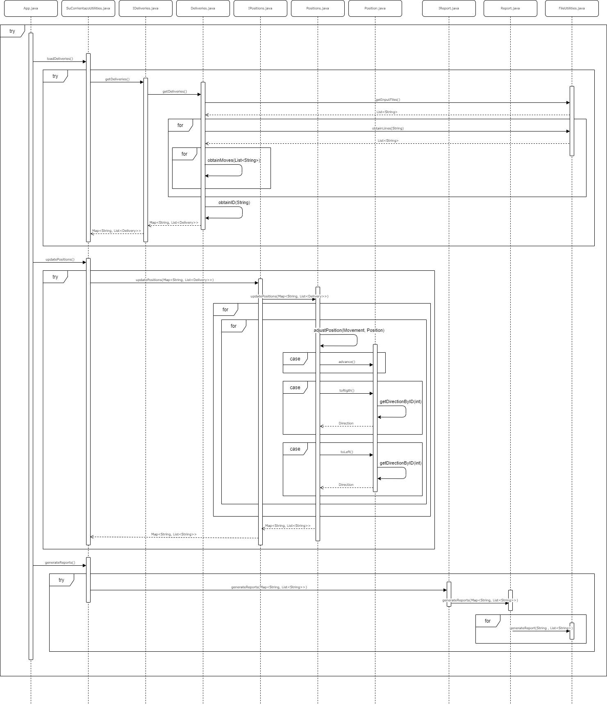
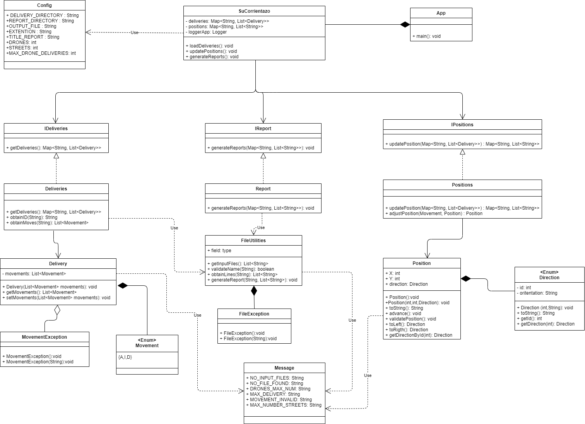

# S4N
S4N backend test

## S4N-Description

This is the repositorie for the S4N backend test. It contains the app that give a Solution for "Su corrientazo a domicilio".

### Instructions

* Clone the repository
* In the [Config.java](Project/corrientazo/src/main/java/sucorrientazo/utilities/Config.java) file modify:

- The max number of drones as DRONES
- The range of the area that drones can delivery as STREETS
- The max number of deliveries per drone as MAX_DRONE_DELIVERIES

* The input files should by added in the [deliveries](Project/deliveries) folder. 
* After run the app, you can check the output files in the [deliveries](Project/deliveries) folder. 

### Release History

* V.1.0
    * CHANGE: Basic version
* v.1.1
    * CHANGE: Bug Correction from unit test v1.0

### Notes

* The app validate if exist some file with the appropiate name
* The app check if there is any invalid movement (Different from AID)
* Tha app check the maximun range for drones
* The app check the number of deliveries for each drone

## Tecnical information

This app whats created using maven as the build System, and JUnit for unit test.

The app was created using Eclipse IDE

### Sequence Diagram 

### Class Diagram

